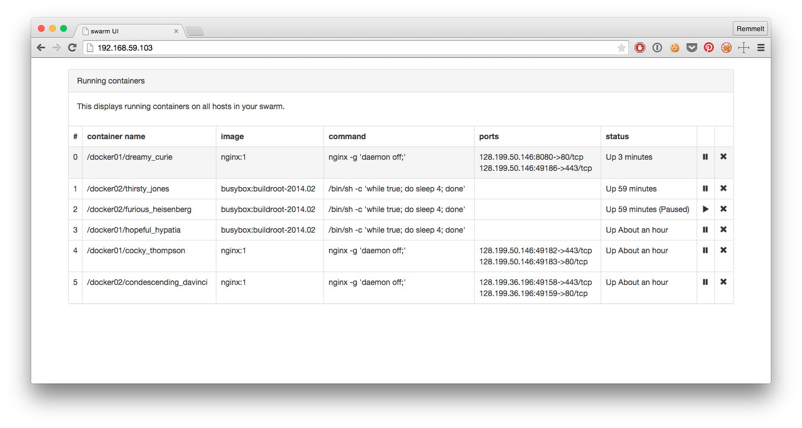

# Swarm UI 

## Set up your swarm!
1. Start a bunch of machines, for example on Digital Ocean. Use the docker image, smallest size will do.
2. SSH into each machine, replace `/usr/bin/docker` with the one from the [master builds](https://master.dockerproject.com/linux/amd64/docker-1.3.2-dev)
3. Add `DOCKER_OPTS="-H 0.0.0.0:2375"` to `/etc/default/docker` on each of your hosts
4. Restart docker on each host by entering `service docker restart`
5. Build the `swarm` binary on any machine using the [swarm builder](https://github.com/remmelt/docker-swarm-builder)
6. Upload the `swarm` binary to each host
7. On one of the hosts, run `swarm create` and remember the `TOKEN` that is returned
8. On all the hosts, join the swarm cluster by running `swarm join --token=<TOKEN> --addr=<local IP>:2375 &`

## Start the UI
1. Clone the repository: `git clone https://github.com/remmelt/swarm-ui.git`
2. `run.sh <TOKEN>` will expose port 80 on the local machine or boot2docker VM
3. Open [192.168.59.103:80](http://192.168.59.103/) in your browser
4. Note the kill (not delete!) and pause/unpause buttons.

## What's going on?
The UI is a [Docker](https://www.docker.com/) container running `swarm manage`. The swarm manager connects to your swarm by finding its nodes through  [the hub's discovery service](https://discovery-stage.hub.docker.com/v1/clusters/<TOKEN>).

Besides swarm, it's running nginx. Nginx serves up the `index.html` that is currently the entire webapp, and reverse proxies to the swarm manager because it does not yet support CORS.

Through the magic that is javascript and a couple of ajax calls to the swarm API, a table gets filled with the information about all nodes running in the swarm.

Neat!

## TODOs
- This will currently only work with boot2docker. Fix it.
- Make the base URL configurable
- Add functionality as it is implemented in swarm
